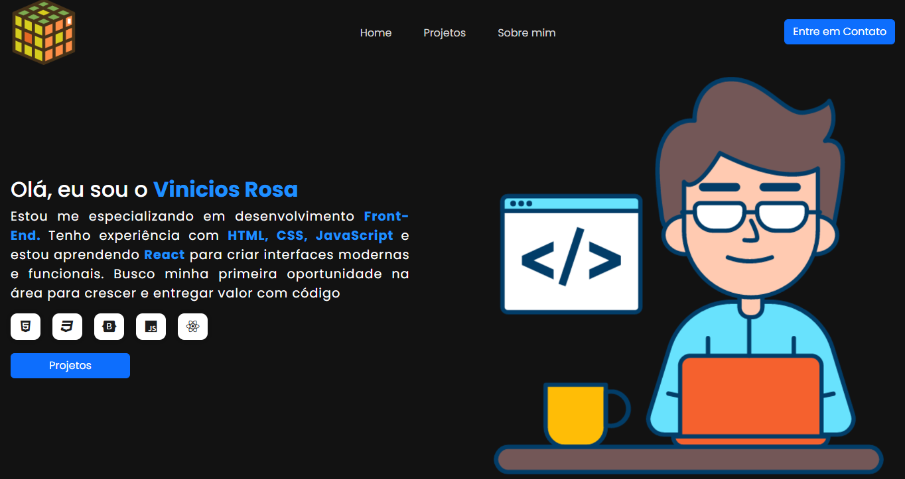

Meu Portfólio
Este é meu portfólio pessoal, desenvolvido para apresentar meus projetos e habilidades na área de Desenvolvimento de Software. Aqui você encontrará exemplos de trabalhos que venho realizando durante meus estudos e minha trajetória em tecnologia.

🚧 Status do Projeto
Este portfólio está em desenvolvimento contínuo. Ainda estou:

Melhorando a responsividade para dispositivos móveis;

Adicionando novos projetos aos slides e seções;

Fazendo pequenos ajustes visuais e estruturais.

Visualização: 
[https://viniciosros4.github.io/Portifolio/]

💻 Tecnologias Utilizadas
HTML5

CSS3

Bootstrap

📌 O que você vai encontrar

Projetos acadêmicos e pessoais;
Experimentos com front-end;

📅 Última atualização
Maio de 2025.

📬 Contato
[https://www.linkedin.com/in/vinicios-rosa-182360351/]

[viniciosrp.dev@hotmail.com]

[15-998343932]

